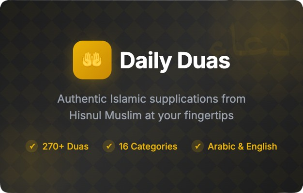

# Daily Duas

A Chrome extension featuring authentic Islamic supplications (duas) from Hisnul Muslim (Fortress of the Muslim).



## Features

- **270+ Duas** - Comprehensive collection of authentic supplications
- **16 Categories** - Organized by occasion (Morning/Evening, Prayer, Travel, etc.)
- **Arabic & English** - Original Arabic text with English translations
- **Hadith References** - Source citations for each dua
- **Search** - Find duas by keyword
- **Favorites** - Save your frequently used duas
- **Dark/Light Theme** - Toggle between themes

## Installation

### From Chrome Web Store
Coming soon...

### Manual Installation
1. Clone this repository
2. Install dependencies:
   ```bash
   npm install
   ```
3. Build the extension:
   ```bash
   npm run build
   ```
4. Open Chrome and go to `chrome://extensions/`
5. Enable "Developer mode"
6. Click "Load unpacked" and select the `dist` folder

## Development

```bash
# Install dependencies
npm install

# Start development server
npm run dev

# Build for production
npm run build
```

## Tech Stack

- React 18
- TypeScript
- Tailwind CSS
- Vite
- Chrome Extension Manifest V3

## License

MIT
